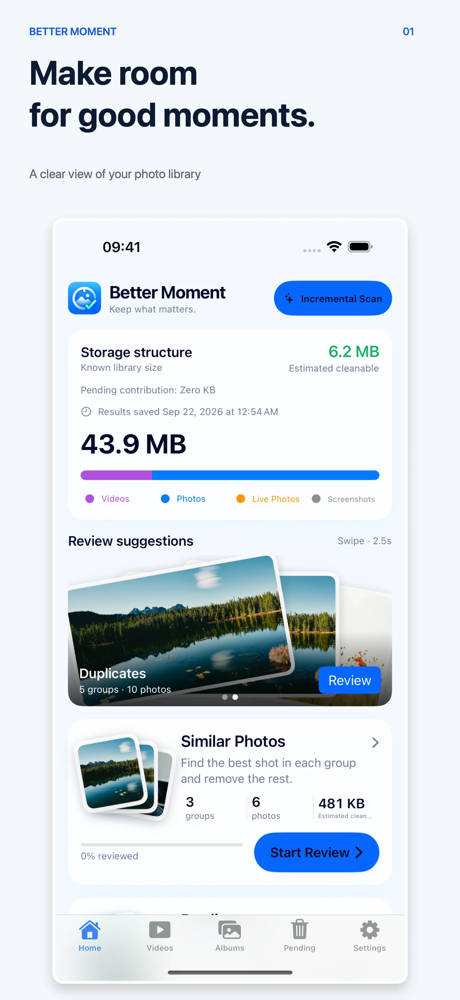
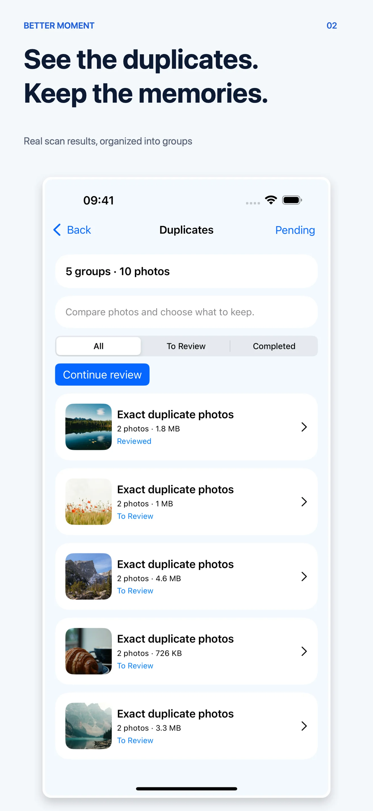
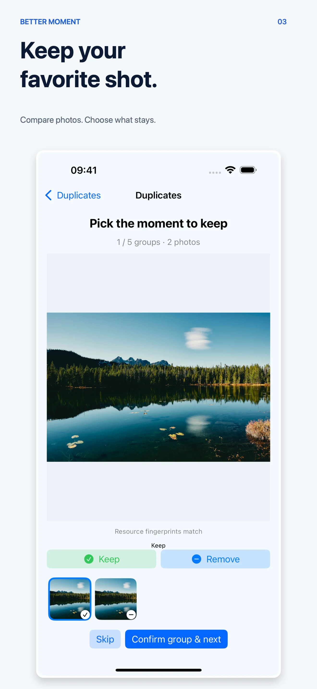
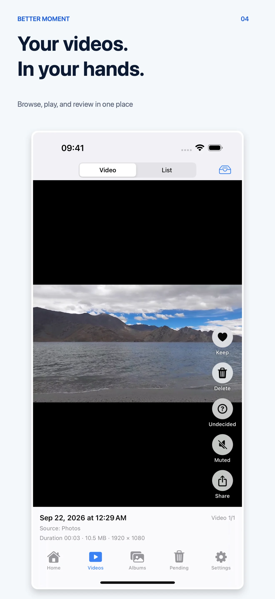
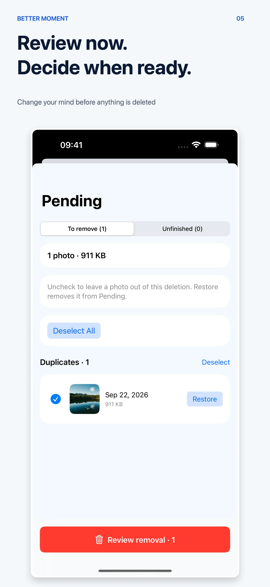
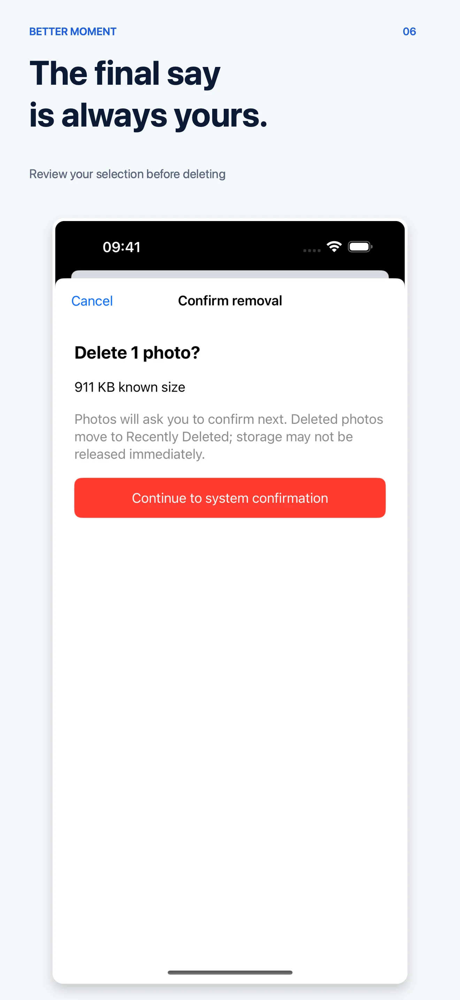

# Better Moment

English · [Chinese](README.zh-CN.md)

**An on-device photo curator for the moments worth keeping.**

Better Moment helps you make room in a crowded photo library without handing over the memories. It groups duplicates and similar shots, surfaces blurry photos and screenshots, and lets you decide what stays. Nothing is deleted before you confirm it.

## Learn more

- [Product page](https://bettermac.net/en/products/better-moment/)
- [Support](https://bettermac.net/en/support/better-moment/)
- [Privacy policy](https://bettermac.net/en/privacy/better-moment/)
- [BetterMac](https://bettermac.net/)

## What it helps you find

- **Duplicates** — exact copies that take up space twice.
- **Similar shots** — bursts and near-identical photos where one favorite is enough.
- **Blurry and low-quality photos** — candidates worth a second look.
- **Screenshots and large files** — the library clutter that is easy to forget.
- **Documents, receipts, and QR codes** — items you may want to archive or clear out.

## Review before anything is removed

Better Moment is built around a simple promise: recommendations are not deletions.

1. Review groups one at a time, or browse other categories in a grid.
2. Keep what matters and mark the rest for review.
3. Change your mind in Pending, with drafts saved automatically.
4. Confirm the final selection before Photos moves anything to Recently Deleted.

Favorites and the last remaining photo in a group are protected. Photos you keep are never touched.

## Screenshots

### iPhone · English

| | | |
|---|---|---|
|  |  |  |
| Library overview | Organized results | Compare and keep |
|  |  |  |
| Browse videos | Review pending items | Confirm removal |

## Privacy first

Photo analysis is designed to run on your device with Apple's frameworks. Better Moment does not need an account or upload your photos for cloud analysis. See the [privacy policy](https://bettermac.net/en/privacy/better-moment/) for the current product details.

## Platforms

Better Moment is currently available for iPhone and iPad. Check the [official product page](https://bettermac.net/en/products/better-moment/) for current availability and requirements.

## About this repository

This is a public product showcase containing selected screenshots and brand materials. It is not the Better Moment source repository.

Better Moment, BetterMacNet, and the materials in this repository are proprietary. All rights reserved. No license is granted to copy, modify, distribute, or use them without prior written permission from BetterMacNet.
