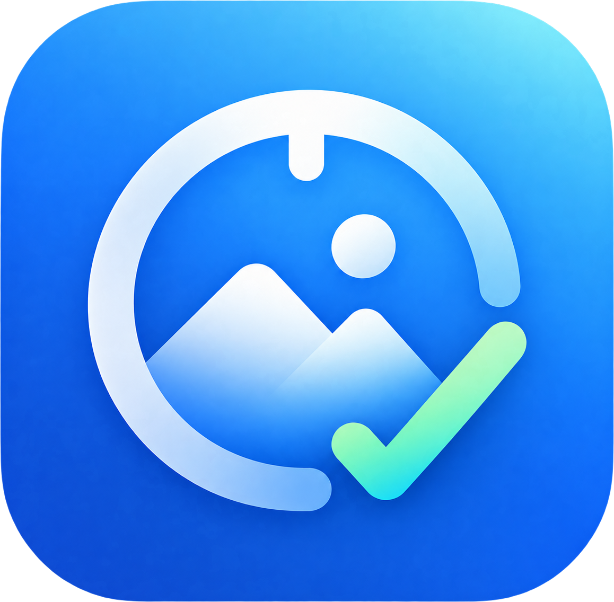
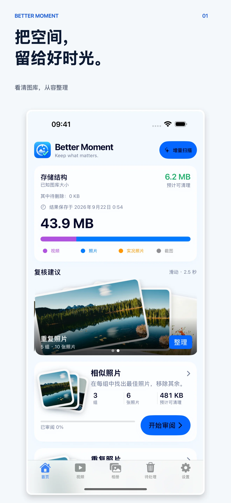
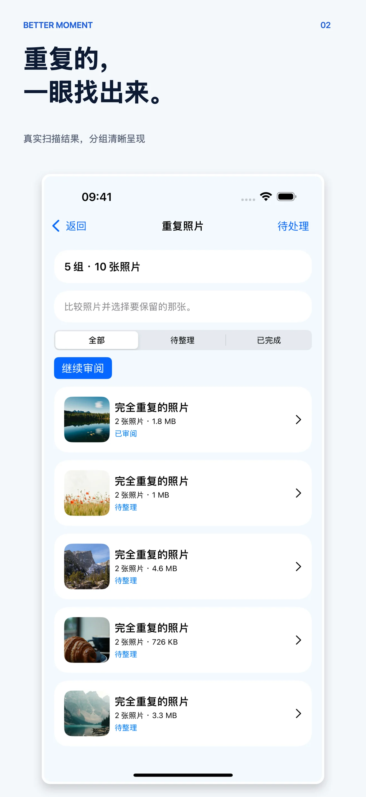
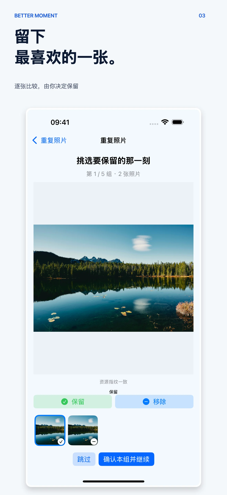
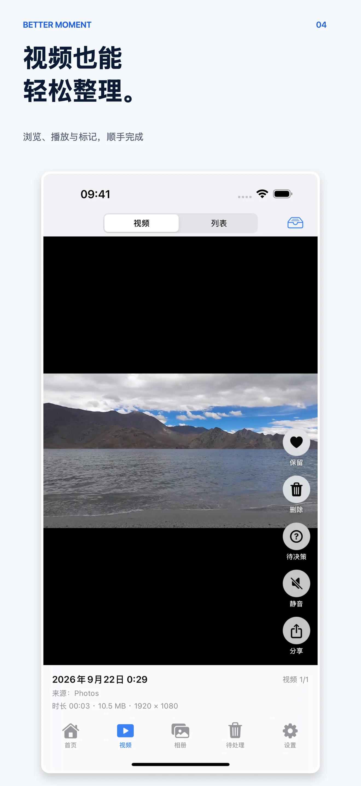
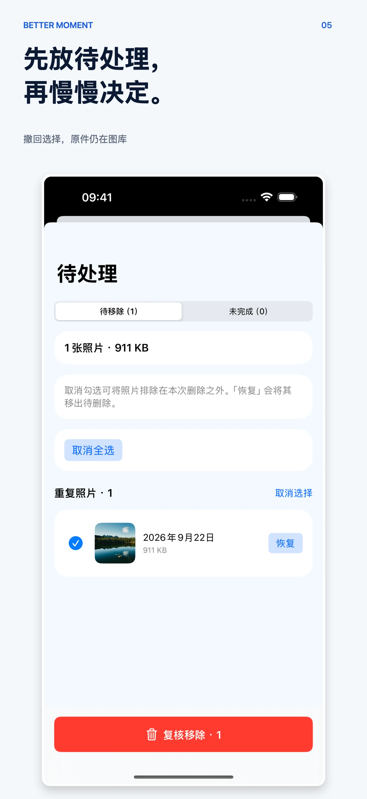
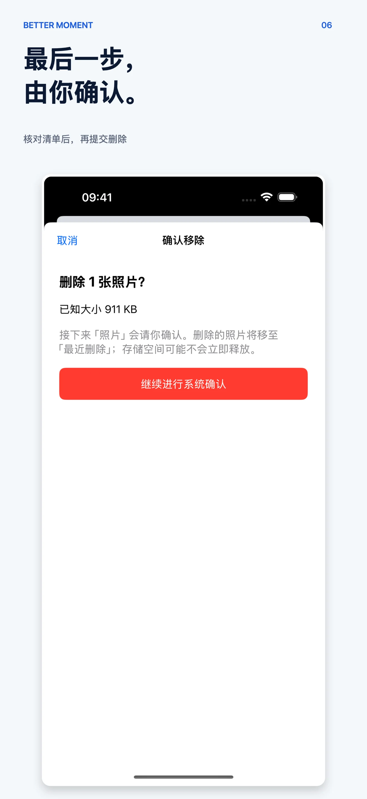

# Better Moment

[英文](README.md) · 简体中文

**把空间留给值得留下的时光。**

Better Moment 帮你整理拥挤的照片图库，同时把决定权留在自己手里。它会归组重复和相似照片，找出模糊照片与截图，再让你决定哪些应该保留。未经确认，不会删除任何照片。

## 了解更多

- [产品页](https://bettermac.net/en/products/better-moment/)
- [支持中心](https://bettermac.net/en/support/better-moment/)
- [隐私政策](https://bettermac.net/en/privacy/better-moment/)
- [BetterMac 官网](https://bettermac.net/)

## 它能帮你找出什么

- **重复照片** —— 占用两份空间的完全相同副本。
- **相似照片** —— 连拍和近似照片，挑出最喜欢的一张。
- **模糊和低质量照片** —— 值得再看一眼的候选内容。
- **截图和大文件** —— 容易被遗忘的图库负担。
- **证件、票据和二维码** —— 可以归档，也可以清理。

## 先检查，再决定是否移除

Better Moment 只有一个简单的承诺：建议不是删除。

1. 逐组检查相似和重复照片，也可以用网格浏览其他分类。
2. 保留重要的，把其余内容标记为待处理。
3. 在「待处理」中随时改主意，草稿会自动保存。
4. 最后确认选择后，「照片」才会把内容移到「最近删除」。

收藏的照片和每组最后一张始终受保护。你选择保留的照片不会被动过。

## 截图

### iPhone · 简体中文

| | | |
|---|---|---|
|  |  |  |
| 图库概览 | 整理后的结果 | 对比并保留 |
|  |  |  |
| 浏览视频 | 检查待处理项目 | 确认移除 |

## 隐私优先

照片分析设计为使用 Apple 框架在设备端完成。Better Moment 不需要账号，也不会为了云端分析上传照片。当前产品详情请查看[隐私政策](https://bettermac.net/en/privacy/better-moment/)。

## 支持平台

Better Moment 当前面向 iPhone 和 iPad 提供。当前可用平台与系统要求请以[官方产品页](https://bettermac.net/en/products/better-moment/)为准。

## 关于本仓库

这是一个公开的产品展示仓库，仅包含精选截图和品牌材料，不是 Better Moment 的源代码仓库。

Better Moment、BetterMacNet 及本仓库中的材料均为专有内容，保留所有权利。未经 BetterMacNet 事先书面许可，不授予复制、修改、分发或使用的许可。
